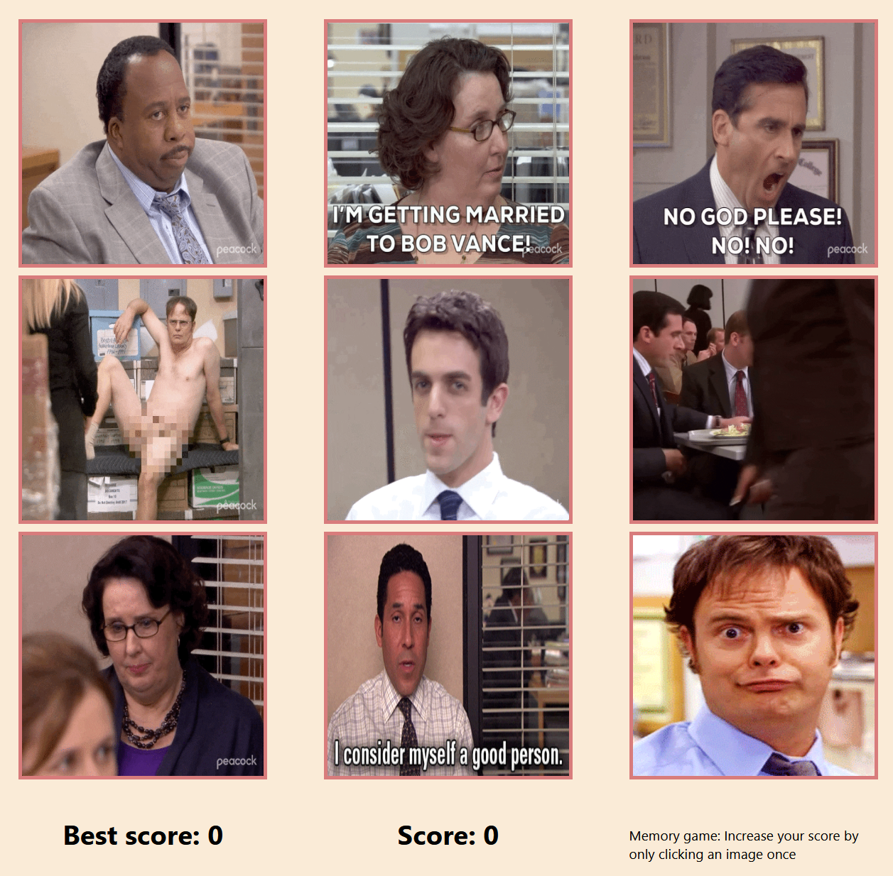

# Memory Game

This project uses React for the frontend. The project aims to practice React hooks like useState and useEffect by fetching data from an external API.

## The Odin Project: Lesson Memory Card

This project is build according to the specification of the [Memory Card lesson](https://www.theodinproject.com/lessons/node-path-react-new-memory-card)

## Live website

You are shown a grid of 9 giphs from characters from the TV show The Office.

At every click, the images are shuffled and you need to reach the end by only clicking every image once.

Access the [Memory Card game](https://memory-card-game-office.netlify.app/)

